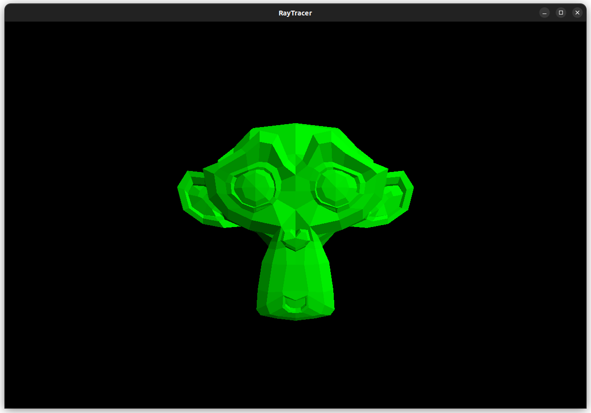

# RayTracer

Ray Tracer with OpenGL and compute shaders.

---

Implemented basic sphere/ray intersection, calculating hit position, normal and shading of spheres.

  
  

Added model loading support and option for switching from flat to shaded view.

Improved memory layout on GPU and fixed normals.

Bounding volume hierarchy with materials. Major fps improvment.

Graphical user interface with imgui. Functionality for loading and deleting models from scene. A bit of info of scene.

Added more options to modify and transform model. And added properties of camera.

  
  
  

Added wireframe view, downsampling, faster scene updating and some refactoring.
